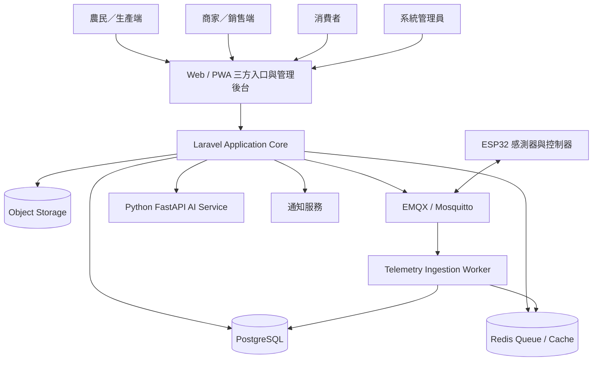
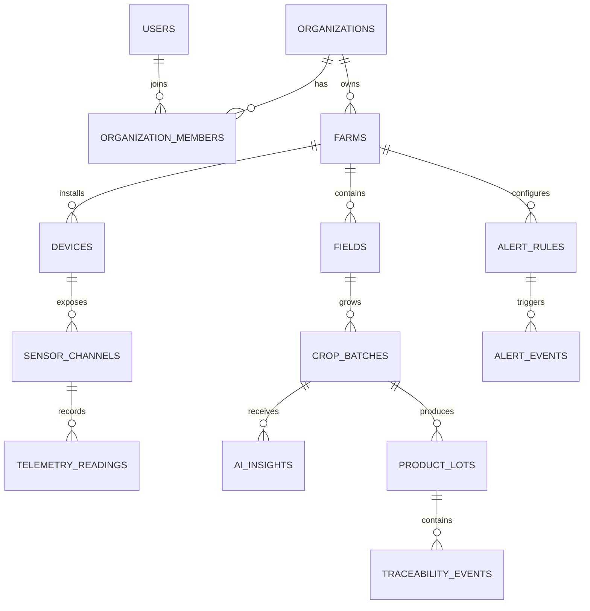

# AiotInOne 智慧農業系統架構

## 1. 架構目標

AiotInOne 採「模組化單體核心＋外部 IoT／AI 服務」設計。Laravel 負責身分、權限、商業流程、資料一致性與三方入口；MQTT Broker 處理設備訊息；Python AI Service 處理模型推論。



## 2. 核心模組

### Identity & Access

- 使用者、組織與角色。
- Producer、Merchant、Consumer、Administrator 權限。
- 農場與商家資料隔離。
- API Token、裝置憑證與稽核紀錄。

### Farm Management

- 農場、田區、溫室。
- 作物、種植批次與預計採收日。
- 農務紀錄、設備綁定與產量紀錄。

### Device Management

- Gateway、Sensor、Actuator。
- 裝置啟用、停用、憑證輪替。
- 上線狀態、韌體版本與最後心跳。
- 感測器量測類型與校正資訊。

### Telemetry

- MQTT Topic 驗證。
- Payload Schema 驗證。
- 訊息去重、時間校正與異常值標記。
- 原始資料、聚合資料與保存週期。

### Alert & Automation

- 固定門檻、持續時間與離線告警。
- 告警確認、解除與通知。
- 設備命令、冪等鍵、逾時與結果回報。
- AI 建議與自動化規則分離。

### AI Insights

- 異常偵測。
- 灌溉需求與環境趨勢預測。
- 產量與採收日期預測。
- 三方角色專屬推薦。
- 模型版本、可信度與解釋紀錄。

### Marketplace & Traceability

- 農產品、批次、供應量與價格。
- 商家採購需求與媒合。
- 消費者商品瀏覽與訂單。
- QR Code 批次追溯與環境摘要。

## 3. MQTT Topic 規範

```text
aiotinone/v1/{tenant_id}/{farm_id}/{device_id}/telemetry
aiotinone/v1/{tenant_id}/{farm_id}/{device_id}/status
aiotinone/v1/{tenant_id}/{farm_id}/{device_id}/command
aiotinone/v1/{tenant_id}/{farm_id}/{device_id}/command-result
```

Telemetry 範例：

```json
{
  "message_id": "01J...",
  "recorded_at": "2026-07-28T05:30:00Z",
  "firmware_version": "1.0.0",
  "readings": [
    {"type": "air_temperature", "value": 28.4, "unit": "celsius"},
    {"type": "air_humidity", "value": 72.1, "unit": "percent"},
    {"type": "soil_moisture", "value": 41.8, "unit": "percent"},
    {"type": "light_intensity", "value": 18300, "unit": "lux"}
  ]
}
```

## 4. 資料模型概念



## 5. 安全控制

- 每台裝置使用獨立憑證與可撤銷身分。
- Broker ACL 必須限制 Topic 範圍。
- 所有遠端控制命令必須有操作者、原因、命令 ID、逾時與結果。
- Actuator 必須具備本地端安全預設，雲端斷線時不可維持危險狀態。
- AI 建議預設需要人工確認；自動模式必須另有規則、上限與緊急停止。
- 追溯頁只能公開經允許的環境摘要，不公開農場敏感資訊。

## 6. 部署拓撲

### 開發環境

Docker Compose：

- nginx
- php-fpm / Laravel
- queue worker
- scheduler
- PostgreSQL
- Redis
- EMQX 或 Mosquitto
- Python FastAPI
- Mailpit

### 正式環境

第一階段可採單區域部署：

- Laravel Web 與 Worker 分離部署。
- Managed PostgreSQL 與 Redis。
- MQTT Broker 獨立部署。
- AI Service 可獨立水平擴充。
- Object Storage 保存圖片與匯出報表。

## 7. 演進方向

1. MVP：智慧農業核心監控與三方入口。
2. Phase 2：自動化控制、進階模型、採購媒合。
3. Phase 3：多租戶 SaaS、計費、開放 API 與合作夥伴生態。
4. Phase 4：將共用 AIoT 核心套用到工廠、校園與居家場景。
