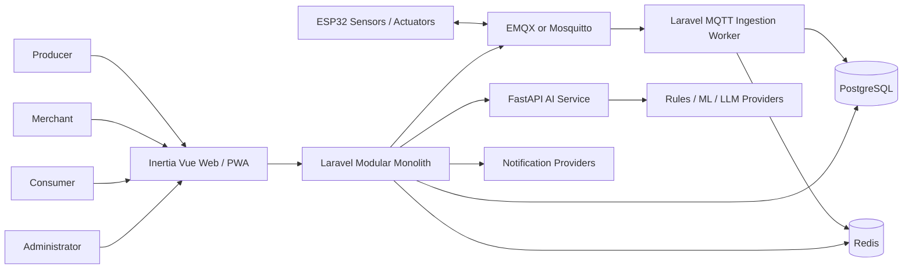

# AiotInOne｜智慧農業 AIoT 三方平台完整產品規格

## 1. 產品願景

AiotInOne 是以 PHP/Laravel 為核心的 AIoT 共用平台。第一個落地產品為智慧農業三方平台，將農場感測、設備控制、AI 分析、供應媒合與消費者追溯整合在同一套可治理架構中。

核心價值不是讓 AI 取代農民，而是讓資料、規則與 AI 成為生產決策的增幅工具，並把生產端資訊安全地延伸到商家與消費者。

## 2. 目標使用者

### Producer｜生產端

- 農民、農場管理者、合作社。
- 管理農場、田區、作物批次、感測器與控制設備。
- 查看即時環境、趨勢、告警、AI 農務建議與預估採收。
- 建立採收及供應批次。

### Merchant｜銷售端

- 採購商、通路商、零售商。
- 搜尋可供應批次、建立採購需求與詢價。
- 查看供應穩定性、追溯資訊與 AI 補貨建議。

### Consumer｜消費端

- 一般消費者。
- 查看公開商品、產地、採收、環境摘要與 QR 追溯。
- 取得當季、新鮮度、保存與料理建議。

### Administrator｜治理端

- 管理帳號、組織、設備、安全、告警、AI 模型、Prompt、資料保存與稽核。
- 不列入商業三方角色。

## 3. 使用者問題

1. 農場資料分散，無法快速判斷環境與設備是否異常。
2. 感測、告警、設備控制與農務紀錄彼此斷裂。
3. AI 建議缺乏版本、依據、可信度與安全邊界。
4. 商家看不到可信的預估供應與批次資訊。
5. 消費者追溯資訊不足或暴露過多農場敏感資料。
6. 多角色、多農場與多裝置容易造成越權與資料混用。

## 4. MVP 功能範圍

### 4.1 帳號與組織

- 註冊、登入、登出、忘記密碼、Email 驗證。
- Producer、Merchant、Consumer、Administrator 角色。
- 組織、成員邀請、角色與 active organization。
- 後端 RBAC、Policy 與跨租戶隔離。

### 4.2 農務管理

- 農場、田區、溫室。
- 作物、品種、種植批次、生長階段與採收預估。
- 灌溉、施肥、巡田、病蟲害、採樣與採收紀錄。
- 農務歷程與修正事件。

### 4.3 裝置與感測

- ESP32 Gateway、Sensor、Actuator 登錄。
- 每台裝置獨立身分、一次性啟用、憑證輪替與撤銷。
- 溫度、空氣濕度、土壤濕度、光照。
- 心跳、連線狀態、韌體版本與校正紀錄。

### 4.4 Telemetry 與告警

- MQTT Topic 與 JSON Schema 驗證。
- message_id 去重、時間品質、最新值快取與聚合資料。
- 最新數值、七天趨勢與資料品質標記。
- 上限、下限、持續時間、離線告警。
- active、acknowledged、resolved 生命週期。

### 4.5 安全設備控制

- 水泵、風扇、閥門人工控制。
- 權限、安全上限、最長執行、最短重啟、有效期限、冪等鍵。
- pending 至 succeeded/failed/timeout 狀態追蹤。
- 裝置端本地安全停止與農場 emergency stop。
- AI 不得直接控制設備。

### 4.6 AI 三合一

- 異常偵測：環境異常、感測漂移、設備故障跡象。
- 預測分析：灌溉需求、採收日期、產量與供應風險。
- 智慧推薦：Producer 農務、Merchant 採購、Consumer 選購與料理。
- Prompt Registry、三套角色模板、JSON Schema、模型路由、快取、成本與回饋。

### 4.7 供應、採購與追溯

- Producer 由採收紀錄建立供應批次。
- Merchant 搜尋供應、建立採購需求與詢價。
- Consumer 查看公開商品及 QR 追溯。
- 公開欄位白名單、位置模糊化與資料品質說明。

### 4.8 治理與維運

- 帳號、組織、裝置、告警、Prompt、模型與設定版本。
- Append-only 稽核、安全事件與支援存取紀錄。
- 結構化日誌、指標、Health、備份、還原與保存週期。

## 5. 明確不在 MVP

- AI 全自動控制設備。
- 正式金流、發票與複雜物流。
- 無人機、衛星、作物影像辨識。
- 區塊鏈追溯。
- 多區域高可用與完整 SaaS 計費。
- 裝置 OTA 自動更新。

## 6. 技術架構

### 技術決策

| 項目 | 決策 |
|---|---|
| 核心後端 | PHP 8.3+ / Laravel 12+ |
| 前端 | Inertia.js / Vue 3 / TypeScript |
| 資料庫 | PostgreSQL 16+ |
| Cache / Queue | Redis 7+ |
| IoT Transport | MQTT v3.1.1 或 v5 |
| Broker | EMQX 或 Mosquitto |
| AI Service | Python 3.12+ / FastAPI |
| 裝置 | ESP32 |
| 本機環境 | Docker Compose |
| API | REST `/api/v1`、OpenAPI |
| 測試 | Pest/PHPUnit、Pytest、Contract、E2E |

## 7. 核心資料流

### Telemetry

1. ESP32 以裝置憑證連線 Broker。
2. Broker ACL 驗證 Topic 範圍。
3. Ingestion 驗證 Schema、裝置、單位、時間與 message_id。
4. 原始訊息短期保存，正規化 readings 寫入 PostgreSQL。
5. 最新值寫入 Redis，聚合工作建立分鐘、小時與日資料。
6. 告警規則評估並建立事件與通知。

### AI

1. Laravel 組裝最小必要 features。
2. AI Orchestrator 選擇角色 Prompt、Schema、快取與模型。
3. FastAPI 或 provider 回傳結構化結果。
4. Laravel 驗證並保存模型、版本、可信度、解釋與成本。
5. UI 標示 AI 建議；高風險建議由人確認。

### Device Command

1. 使用者提出人工命令。
2. Laravel 執行 Policy 與安全限制。
3. 建立具冪等鍵與有效期限的 pending command。
4. 發布 MQTT command，裝置再次驗證本地安全。
5. 裝置回報 command-result，平台更新狀態與稽核。

## 8. 安全原則

- 每台裝置獨立憑證與最小 Topic ACL。
- 密碼、Token、裝置祕密不得寫入 Git、日誌或 AI 輸入。
- 高風險操作需明確確認、原因、稽核與逾時。
- AI Service 不得取得控制 Broker 憑證。
- 公開追溯採白名單，不公開精確位置與內部原始資料。
- 管理員與支援人員亦須經角色、原因、時效與稽核限制。

## 9. 產品成功指標

- 新裝置從建立到成功上傳首筆資料可在 15 分鐘內完成。
- 最新 telemetry 在正常負載下 10 秒內出現在 Dashboard。
- 重複 message 不產生重複 reading。
- 告警規則持續超標只建立一個活動事件。
- 設備命令可完整追蹤請求、發布、回報與逾時。
- 三方 AI 回應具有明顯不同目的與資料邊界。
- Consumer QR 頁無須登入且不洩漏敏感農場資料。
- 所有 P0 驗收案例、測試與 OpenSpec verify 通過。

## 10. 開發順序

1. OpenSpec 與開發環境。
2. Identity、Organization、Farm。
3. Device Registry、MQTT、Telemetry。
4. Dashboard、Alert、Notification。
5. Safe Device Command。
6. AI Service、Prompt Registry、Cache。
7. Producer、Merchant、Consumer、Admin Portals。
8. Supply、Procurement、Traceability。
9. Security、Performance、Backup、E2E。
10. Verify、規格同步與 Archive。
