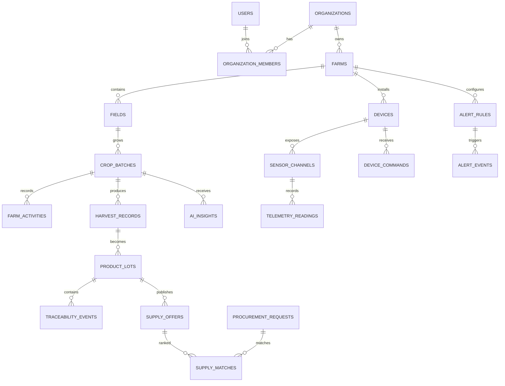

# AiotInOne 邏輯資料模型

## 1. 命名與共通欄位

- 主鍵優先使用 UUID/ULID。
- 多租戶資料表 SHALL 具有 `organization_id` 或明確授權關聯。
- 交易資料使用 `created_at`、`updated_at`；生命週期事件另保存狀態時間。
- 所有時間以 UTC 儲存。
- 金鑰、Token、裝置祕密只保存雜湊、加密值或外部 Secret Reference。
- 重要刪除採 soft delete 或狀態封存；稽核與追溯事件採 append-only。

## 2. Identity and Organization

| Table | 主要欄位 | 說明 |
|---|---|---|
| `users` | id, name, email, password_hash, status, locale, timezone | 個人帳號 |
| `organizations` | id, type, name, status, timezone, contact_metadata | Producer/Merchant/Platform 組織 |
| `organization_members` | organization_id, user_id, role, status | 組織成員與角色 |
| `organization_invitations` | token_hash, email, role, expires_at, accepted_at | 單次邀請 |
| `roles` / `permissions` | name, scope | 權限模型 |
| `audit_events` | actor, action, resource, result, reason, correlation_id | Append-only 稽核 |

## 3. Farm and Crop

| Table | 主要欄位 | 說明 |
|---|---|---|
| `farms` | organization_id, name, status, timezone, public_region | 農場 |
| `fields` | farm_id, name, type, area, area_unit, location_private | 田區／溫室 |
| `crop_types` | name, scientific_name, default_unit | 作物目錄 |
| `crop_varieties` | crop_type_id, name | 品種 |
| `crop_batches` | field_id, crop_variety_id, planted_at, status, growth_stage, estimated_harvest_at | 種植批次 |
| `crop_batch_events` | crop_batch_id, type, payload, source, occurred_at | 生命週期事件 |
| `farm_activities` | crop_batch_id, type, amount, unit, performed_at, operator_id | 農務紀錄 |
| `input_products` | organization_id, category, name, batch_no | 肥料、農藥、資材 |
| `harvest_records` | crop_batch_id, harvested_at, quantity, unit, grade, loss_quantity | 採收紀錄 |

## 4. Device and Telemetry

| Table | 主要欄位 | 說明 |
|---|---|---|
| `devices` | organization_id, farm_id, type, model, status, firmware_version, last_seen_at | 裝置 |
| `device_credentials` | device_id, credential_type, secret_hash/reference, status, expires_at | 裝置憑證 |
| `sensor_channels` | device_id, measurement_type, unit, min_value, max_value | 感測通道 |
| `actuator_channels` | device_id, actuator_type, allowed_states, max_run_seconds, restart_delay_seconds, safe_state | 控制通道 |
| `device_calibrations` | sensor_channel_id, method, offset, calibrated_at, due_at | 校正紀錄 |
| `telemetry_messages` | device_id, message_id, schema_version, recorded_at, received_at, status | 原始訊息索引 |
| `telemetry_readings` | sensor_channel_id, message_id, value, unit, recorded_at, quality | 正規化量測 |
| `telemetry_aggregates` | channel_id, granularity, bucket_at, min, max, avg, count | 聚合資料 |
| `invalid_messages` | device_id, message_id, error_code, payload_reference | 無效訊息／DLQ |

### 建議索引

- `telemetry_messages(device_id, message_id)` unique。
- `telemetry_readings(sensor_channel_id, recorded_at)`。
- `telemetry_aggregates(channel_id, granularity, bucket_at)` unique。
- 高頻資料量增加後保留 TimescaleDB 或分割表遷移點。

## 5. Alerts and Commands

| Table | 主要欄位 | 說明 |
|---|---|---|
| `alert_rules` | organization_id, scope_type, scope_id, metric, operator, threshold, duration_seconds, severity, version | 告警規則 |
| `alert_events` | alert_rule_id, resource, status, triggered_at, acknowledged_at, resolved_at | 告警事件 |
| `alert_event_notes` | alert_event_id, user_id, body | 處理註記 |
| `device_commands` | device_id, channel_id, action, parameters, idempotency_key, status, issued_by, expires_at | 控制命令 |
| `command_results` | command_id, status, device_reported_at, payload | 裝置結果 |
| `emergency_stops` | scope_type, scope_id, status, activated_by, reason | 緊急停止 |

### 一致性規則

- 同一 rule/resource 同時間最多一個 active alert。
- `device_commands` 的 idempotency key 在指定範圍內 unique。
- emergency stop active 時不得建立啟動型命令。

## 6. AI

| Table | 主要欄位 | 說明 |
|---|---|---|
| `prompt_templates` | role, purpose, version, input_schema, output_schema, status | Prompt Registry |
| `ai_model_versions` | provider, model, version, status, configuration | 模型版本 |
| `ai_requests` | request_id, insight_type, role, subject, prompt_version, model_version, status | 推論請求 |
| `ai_insights` | request_id, result, confidence, explanation, generated_at, expires_at | 結構化結果 |
| `ai_cache_entries` | cache_key, result_reference, source_version, expires_at | JSON 快取 |
| `ai_usage_ledger` | request_id, input_tokens, output_tokens, estimated_cost, latency_ms, cache_status | 使用量與成本 |
| `ai_feedback` | insight_id, user_id, rating, reason, status | 人工回饋 |

## 7. Marketplace and Traceability

| Table | 主要欄位 | 說明 |
|---|---|---|
| `products` | producer_organization_id, crop_type_id, name, status | 商品主檔 |
| `product_lots` | product_id, crop_batch_id, harvest_record_id, quantity, unit, grade, status | 商品／供應批次 |
| `supply_offers` | product_lot_id, available_from, available_until, price, currency, status | 可供應資訊 |
| `procurement_requests` | merchant_organization_id, product_requirement, quantity, unit, needed_at, status | 採購需求 |
| `supply_matches` | request_id, supply_offer_id, score, reasons, model_version | 媒合建議 |
| `inquiries` | merchant_id, producer_id, supply_offer_id, status, expires_at | 詢價流程 |
| `reservations` | supply_offer_id, merchant_id, quantity, expires_at, status | 意向保留 |
| `traceability_events` | product_lot_id, event_type, payload, occurred_at, correction_of | 追溯事件 |
| `public_trace_profiles` | product_lot_id, public_id, field_whitelist, status | QR 公開設定 |
| `safety_notices` | product_lot_id, severity, message, active_from, resolved_at | 食安／召回通知 |

## 8. Notifications and Operations

| Table | 主要欄位 | 說明 |
|---|---|---|
| `notification_preferences` | user_id, event_type, channel, enabled | 通知偏好 |
| `notifications` | user_id, event_id, type, status, read_at | 站內通知 |
| `notification_deliveries` | notification_id, channel, provider, status, attempt_count | 外部發送 |
| `security_incidents` | severity, status, source, assigned_to, details | 安全事件 |
| `configuration_versions` | type, scope, version, content, status, approved_by | 設定版本 |
| `data_holds` | scope_type, scope_id, reason, active_until | 保存鎖定 |
| `export_jobs` | requested_by, scope, status, file_reference, expires_at | 非同步匯出 |

## 9. 關聯摘要

## 10. Migration 原則

1. 每次 Schema 變更必須可回滾或提供明確資料遷移程序。
2. 破壞性欄位刪除分成新增替代欄位、雙寫／回填、讀取切換、最終移除。
3. 高資料量 migration 必須支援分批與監控，不得長時間鎖表。
4. Seed data 只放測試或公開範例，不得包含真實憑證與個資。
