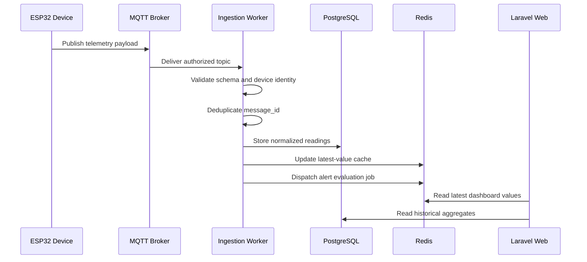
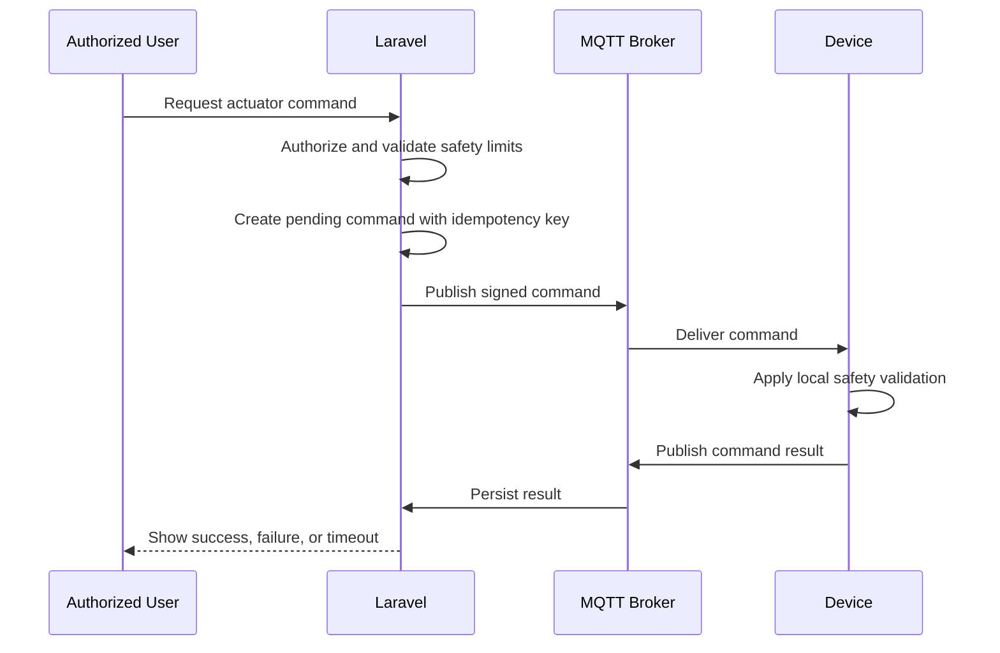

# Technical Design: Bootstrap Smart Agriculture Platform

## 1. Decision Summary

| Area | Decision |
|---|---|
| Core backend | PHP 8.3+ with Laravel 12+ |
| Architecture | Modular monolith for business core |
| Primary database | PostgreSQL 16+ |
| Cache and queue | Redis 7+ |
| IoT transport | MQTT v3.1.1 or v5 through EMQX/Mosquitto |
| AI service | Python 3.12+ with FastAPI |
| Web UI | Inertia.js + Vue 3 + TypeScript, unless implementation spike proves Blade/Livewire materially simpler |
| Local runtime | Docker Compose |
| API style | Versioned REST API under `/api/v1` |
| Authentication | Laravel session for web; Sanctum token for API |
| Authorization | Policies and role/permission matrix |
| Tests | Pest/PHPUnit, Pytest, contract tests |

## 2. Repository Layout

```text
AiotInOne/
├── AGENTS.md
├── README.md
├── apps/
│   └── platform/                 # Laravel application
├── services/
│   └── ai/                       # FastAPI service
├── firmware/
│   └── esp32/                    # ESP32 examples and simulator
├── infra/
│   └── docker/                   # Compose and service configs
├── packages/
│   └── contracts/                # Shared JSON schemas / OpenAPI artifacts
├── docs/
│   ├── architecture/
│   ├── api/
│   ├── operations/
│   └── security/
└── openspec/
    ├── project.md
    ├── specs/
    └── changes/
```

## 3. Bounded Modules

Laravel 模組採清楚命名空間與服務邊界，第一階段不拆成多個獨立部署服務。

```text
App\Modules\Identity
App\Modules\Organizations
App\Modules\Farms
App\Modules\Devices
App\Modules\Telemetry
App\Modules\Alerts
App\Modules\Automation
App\Modules\AIInsights
App\Modules\Marketplace
App\Modules\Traceability
App\Modules\Administration
```

每個模組至少包含 Domain、Application、Infrastructure、Http 四層，但避免為了形式建立沒有行為的空抽象。

## 4. Identity and Tenant Model

- `users` 保存個人帳號。
- `organizations` 表示農場組織、商家組織或平台治理組織。
- `organization_members` 保存使用者在組織中的角色。
- Consumer 可不屬於任何商業組織。
- Producer 與 Merchant 的資料透過 `organization_id` 隔離。
- Administrator 權限不可只依前端選單隱藏，所有 API 必須後端授權。

建議角色：

- `producer_owner`
- `producer_operator`
- `merchant_owner`
- `merchant_buyer`
- `consumer`
- `platform_admin`
- `support_auditor`

## 5. IoT Data Flow



### Telemetry Processing Rules

1. Topic 中的 tenant、farm、device 必須與裝置憑證權限一致。
2. Payload 必須包含 `message_id`、`recorded_at`、`readings`。
3. `message_id` 在同一裝置內必須唯一。
4. 過度偏離伺服器時間的資料要標記，不可靜默覆寫時間。
5. 原始 payload 可短期保存供除錯，正規化資料用於查詢。
6. 高頻資料需建立分鐘、時、日聚合，避免 Dashboard 直接掃描原始資料。

## 6. Device Command Safety



控制命令必須包含：

- command ID
- actuator type
- desired state
- issued at
- expires at
- requested by
- reason
- idempotency key

MVP 預設人工操作，AI 只能產生 recommendation。任何自動化執行需另開 OpenSpec change。

## 7. AI Service Contract

Laravel 透過 HTTP 呼叫 AI Service，長時間任務改用 Queue。

### Request

```json
{
  "request_id": "01J...",
  "insight_type": "irrigation_recommendation",
  "subject": {
    "farm_id": "...",
    "field_id": "...",
    "crop_batch_id": "..."
  },
  "features": {
    "latest": {},
    "aggregates": {},
    "crop_context": {}
  }
}
```

### Response

```json
{
  "request_id": "01J...",
  "model": "baseline-irrigation",
  "model_version": "1.0.0",
  "result": {},
  "confidence": 0.81,
  "explanation": ["土壤濕度低於該作物目前生長階段建議範圍"],
  "generated_at": "2026-07-28T06:00:00Z"
}
```

Laravel 必須保存 request、response 摘要、模型版本、可信度、狀態與錯誤。AI Service 不得直接連線設備 Broker 發送控制命令。

## 8. Three-Party Experience

### Producer Portal

- 農場總覽。
- 即時感測卡片與趨勢圖。
- 告警與待處理事項。
- AI 農務建議。
- 作物批次與預估採收。
- 供應上架。

### Merchant Portal

- 可供應商品與批次。
- 預估供應量與採購需求。
- AI 採購、補貨與短缺風險建議。
- 供應商與批次追溯。

### Consumer Portal

- 當季商品與來源農場。
- 批次追溯、採收日期與環境摘要。
- AI 商品、料理與採買組合推薦。

### Administration

- 帳號與組織。
- 設備與連線狀態。
- 告警規則。
- AI 模型版本與執行紀錄。
- 稽核、安全事件與平台設定。

## 9. Data Retention

初始建議：

- 原始 telemetry payload：30 天。
- 正規化高頻 readings：180 天。
- 分鐘與小時聚合：2 年。
- 日聚合、告警、AI insights、追溯事件：依商業需求長期保存。
- 稽核紀錄：至少 1 年。

保存週期必須可配置，正式上線前需依成本與法規重新確認。

## 10. Observability

- 每個 HTTP request 使用 correlation ID。
- MQTT message、alert、AI request 與 device command 必須可串接追蹤。
- 監控 ingestion lag、無效 payload、裝置離線、Queue backlog、AI latency 與錯誤率。
- 日誌不得包含密碼、完整憑證或未遮罩個資。

## 11. Migration Strategy

此為全新專案，採以下順序：

1. 建立 Docker 與 Laravel/FastAPI 骨架。
2. 建立 Identity、Organization、Farm、Device 資料模型。
3. 建立 MQTT 模擬器與 ingestion。
4. 建立 Dashboard 與 Alert。
5. 建立 AI 合約與 baseline 實作。
6. 建立三方入口與追溯頁。
7. 補齊安全、效能與部署驗證。

## 12. Risks and Mitigations

| Risk | Mitigation |
|---|---|
| MVP 過早拆微服務 | 商業核心維持 Laravel 模組化單體 |
| 高頻 telemetry 壓垮交易資料庫 | 聚合表、索引、保存週期與後續時序資料庫遷移點 |
| 裝置憑證外洩 | 每裝置獨立憑證、撤銷、輪替與 Broker ACL |
| AI 給出不安全建議 | 解釋、可信度、人工確認與控制服務隔離 |
| 三方權限越權 | 後端 Policy、組織隔離測試與稽核 |
| 規格與程式漂移 | OpenSpec verify、測試與完成後 archive/sync |
